## Project 6: Final Project Gear Up
The project handout can be found [here](https://cs1230.graphics/projects/final/gear-up).

### Test Cases

#### Ray Marching outputs
**Mandel bulb**
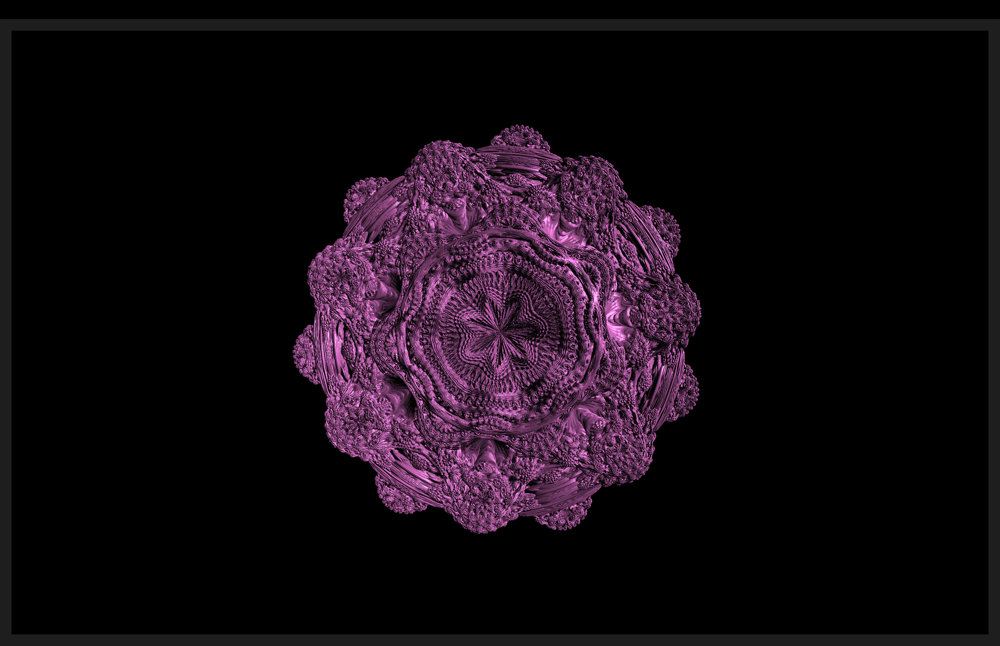

**Menger Sponge**
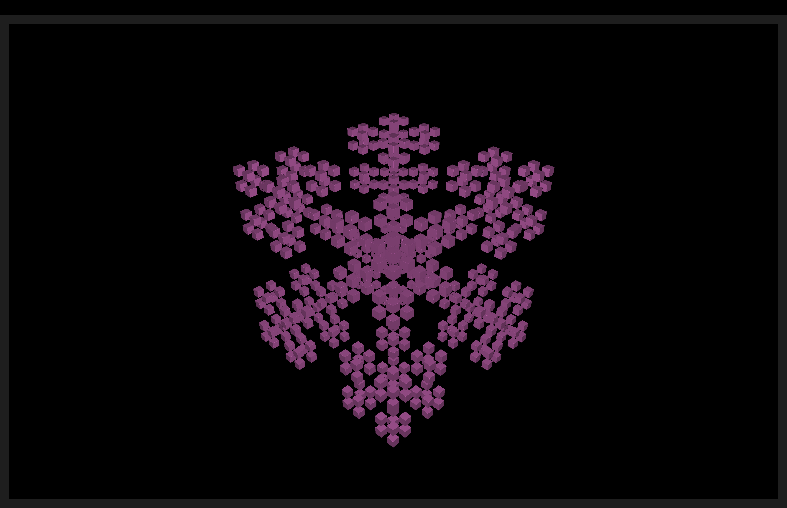

**Julia Quaternion**
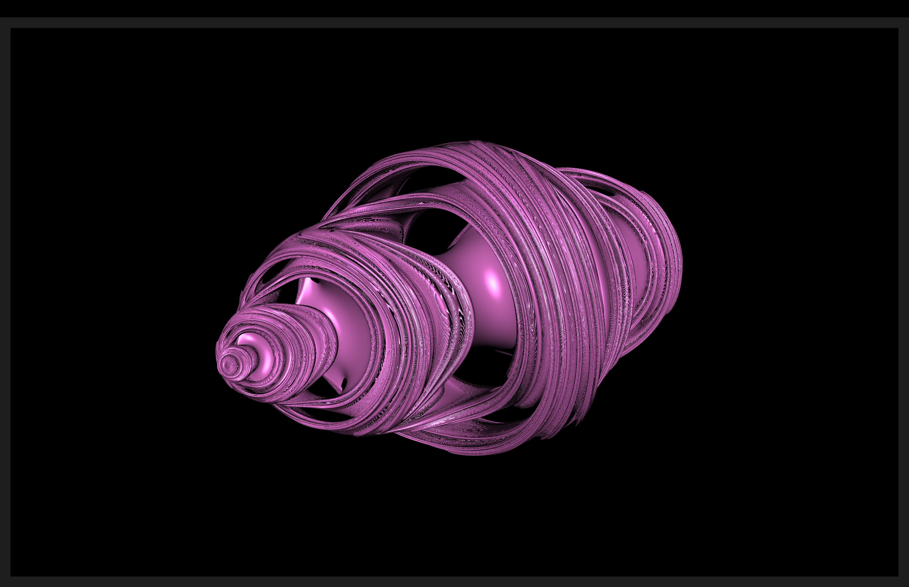

**Terrain**

**Sphere/Torus**
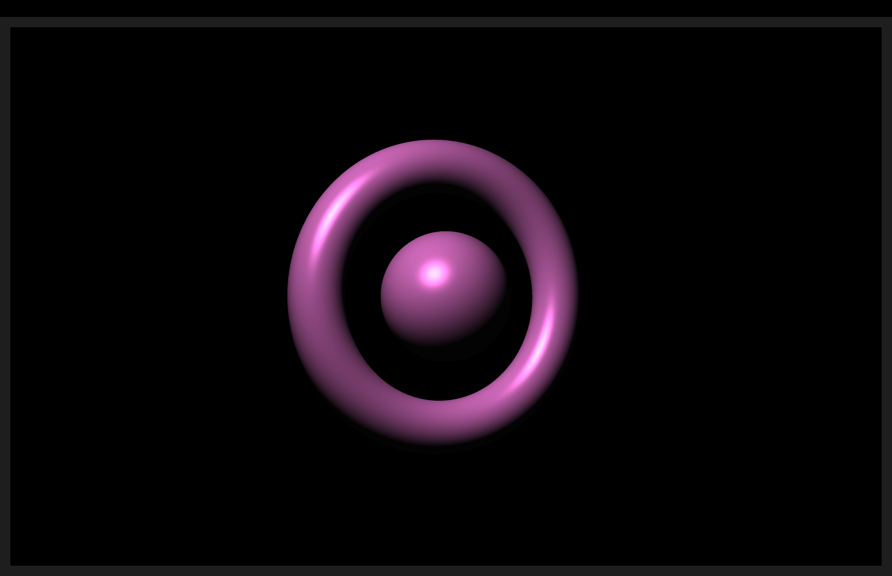

#### HDR vs LDR Rendering
We compare HDR outputs vs LDR outputs under harsh lighting to show how HDR preserves brightness details. 

| Scene | HDR | LDR |
|-------|-----|-----|
| Mandelbulb |  | 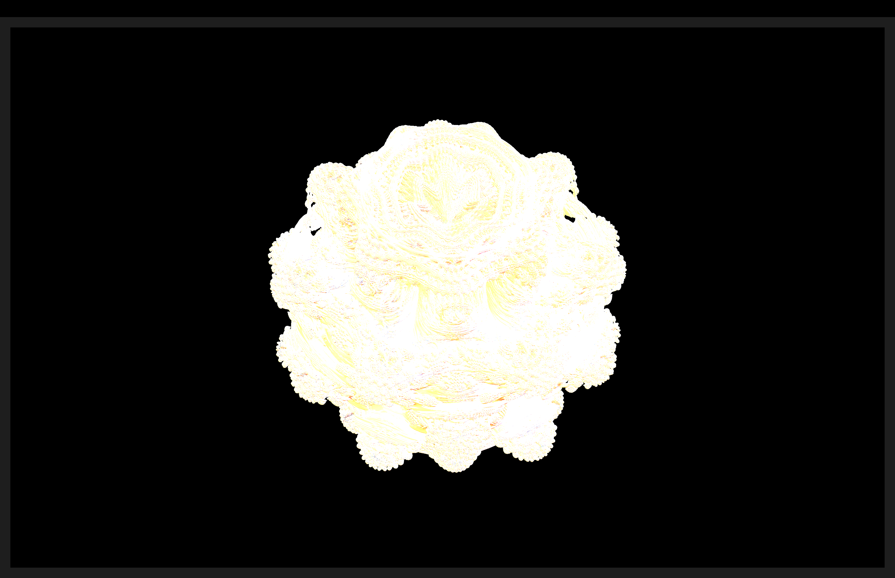 |
| Menger Sponge | 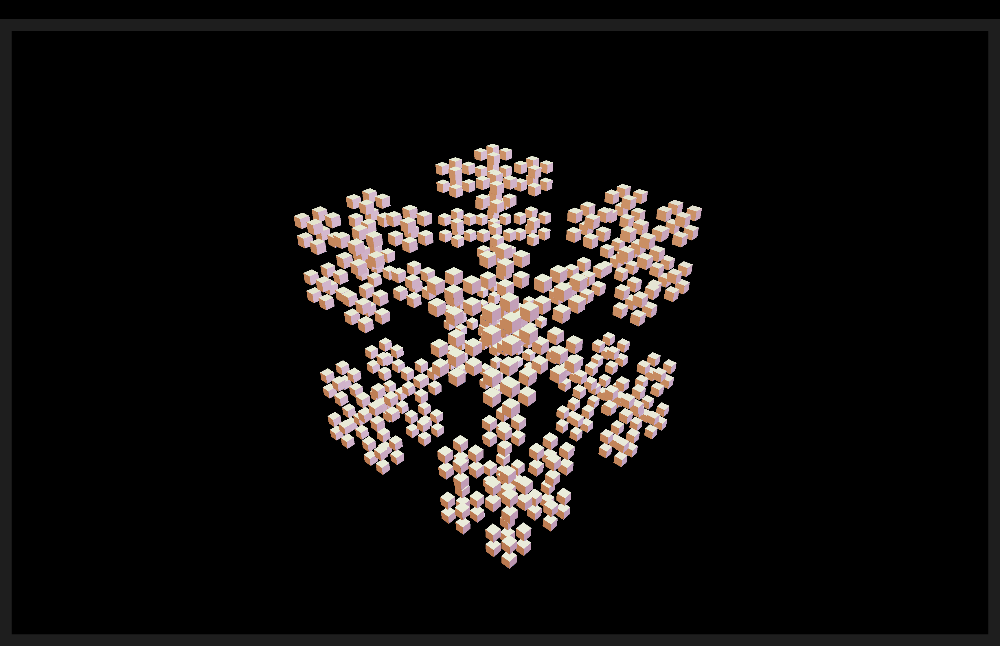 | 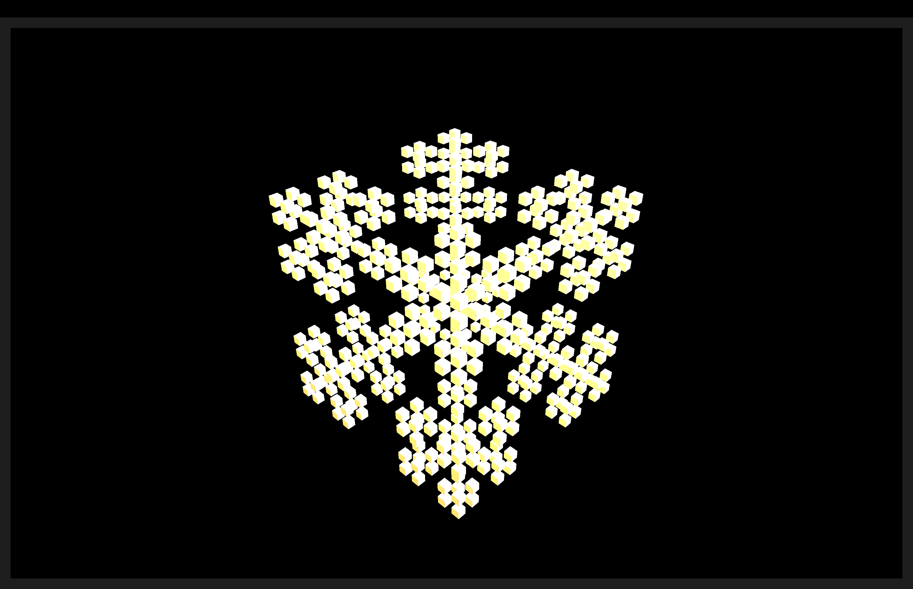 |
| Julia Quaternion | 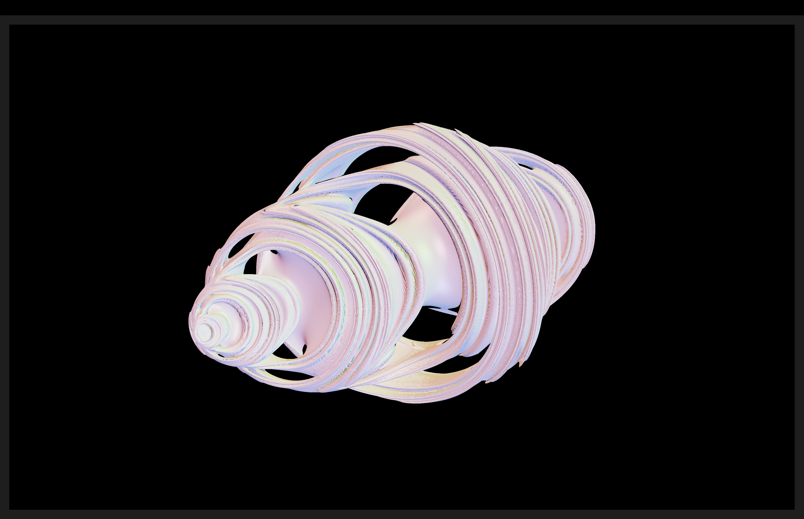 | 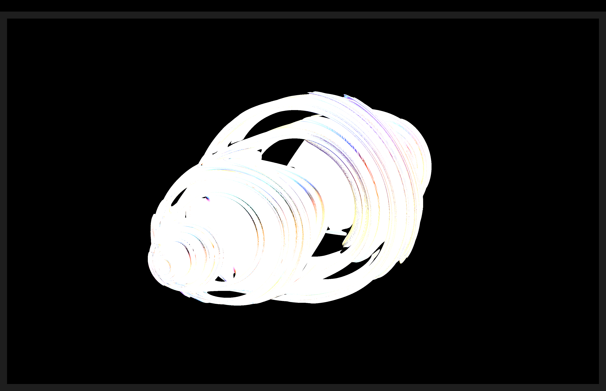 |
| Sphere/Torus | 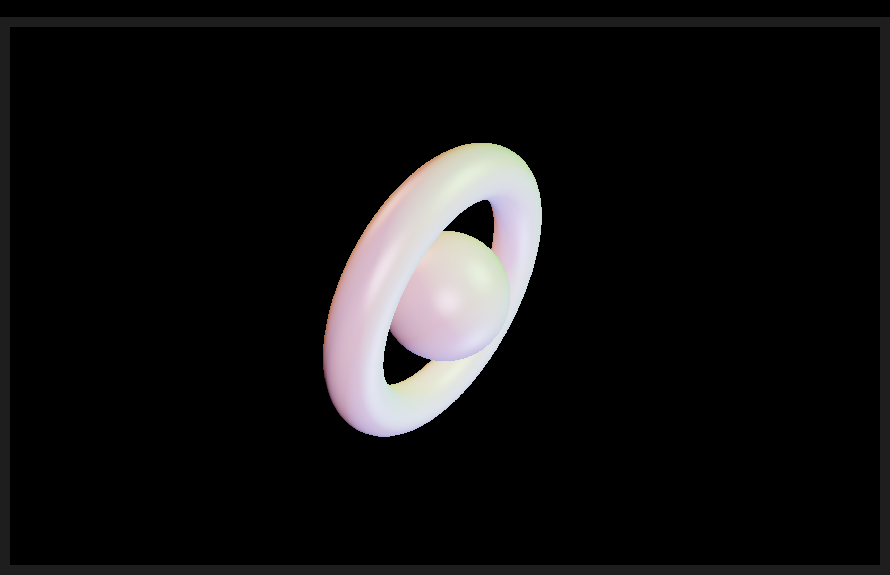 | 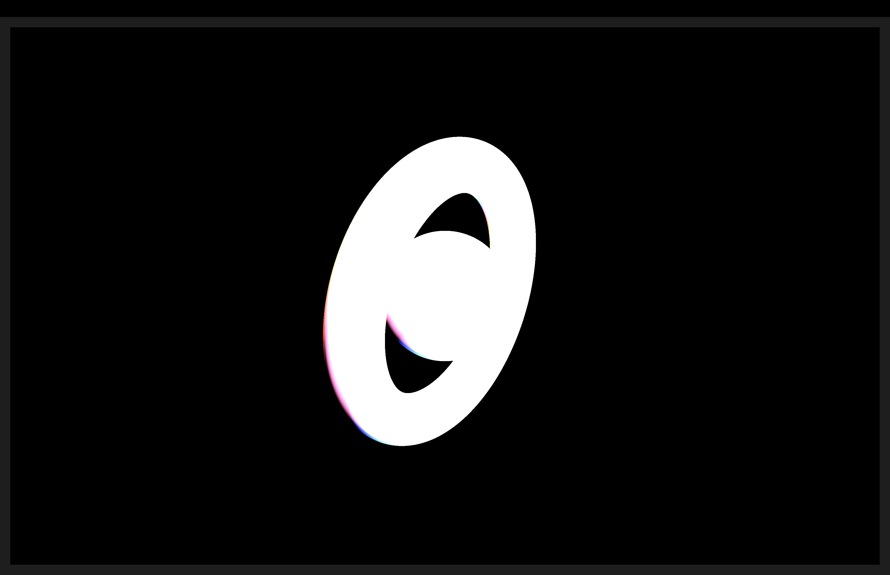 |
| Terrain | 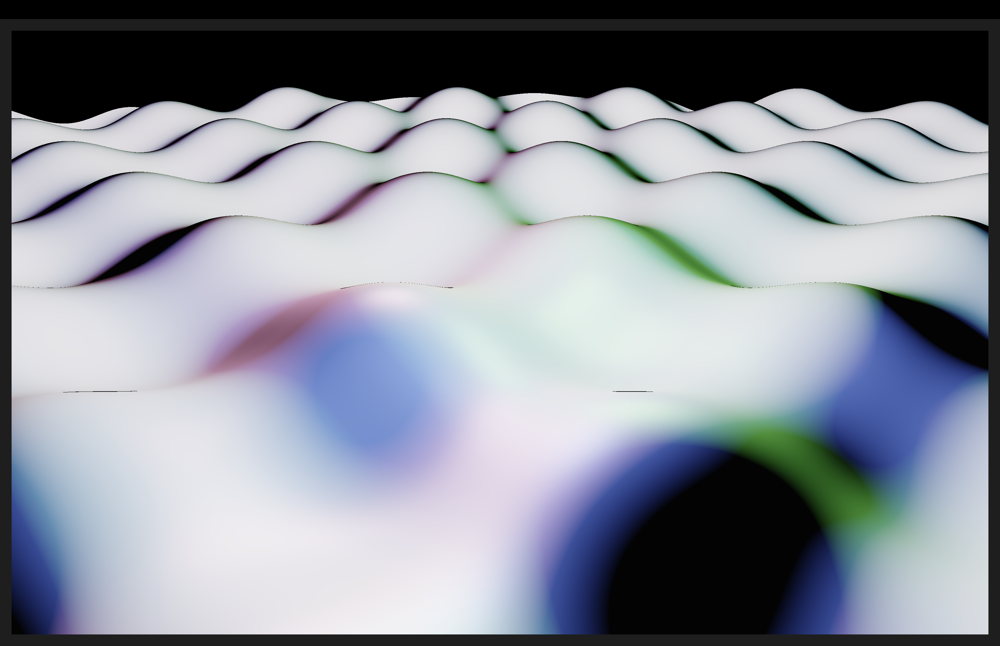 | 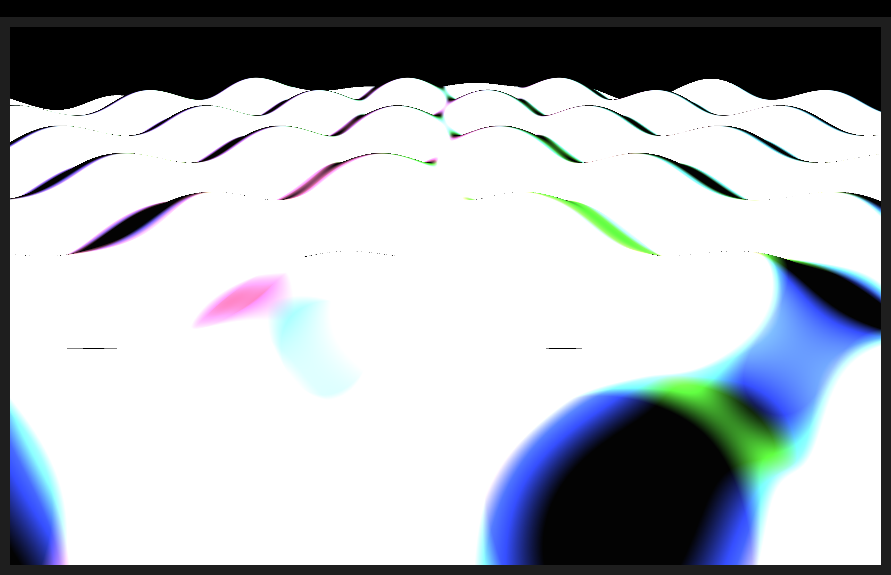 |

### Design Choices
- All SDFs (signed distance functions) for the fractals are implemented directly in the fragment shader along with the ray marching logic.  
- Tone mapping is applied in the fragment shader to properly display bright values.  
- Light intensity and material coefficients were tuned to produce visually distinct results under HDR.  

### Collaboration/References
- ChatGPT was used to help define the SDFs for the following fractals:  
  - Mandelbulb  
  - Menger Sponge  
  - Julia Quaternion  
  - Terrain  
  - Sphere/Torus combo  
- ChatGPT was also used to edit this report for improved flow and coherence

### Known Bugs
- None found during testing 

### Extra Credit
- None 